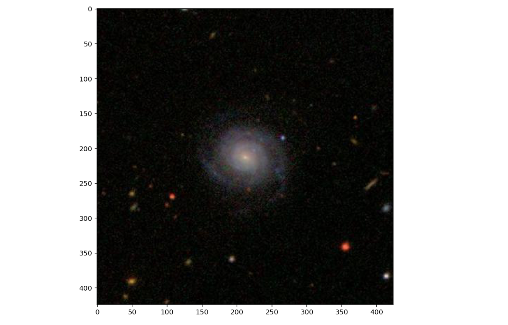
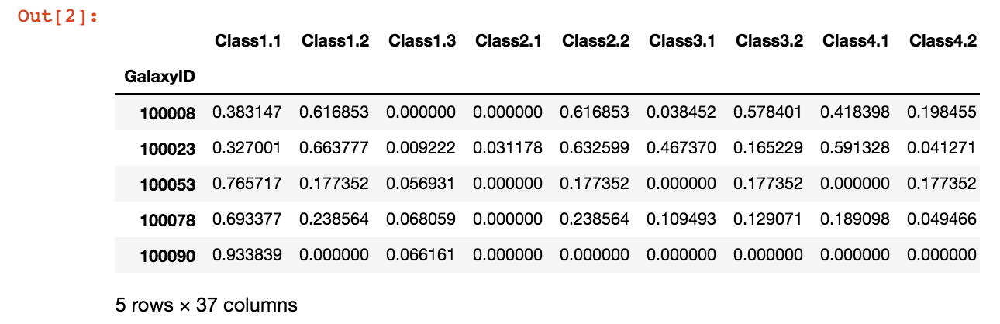
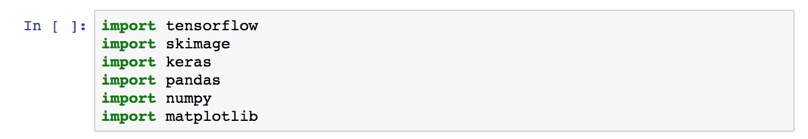
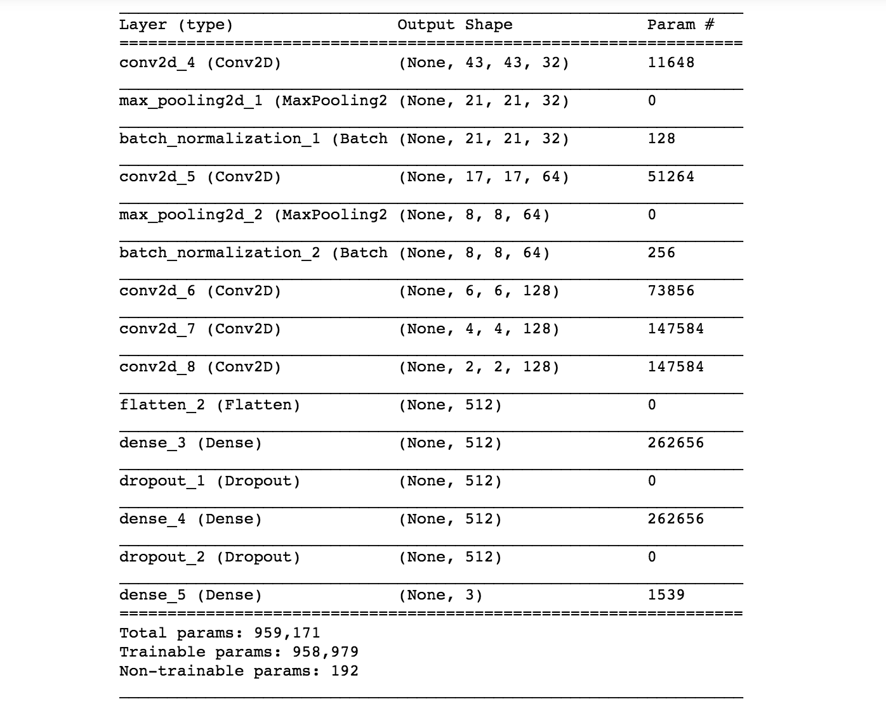
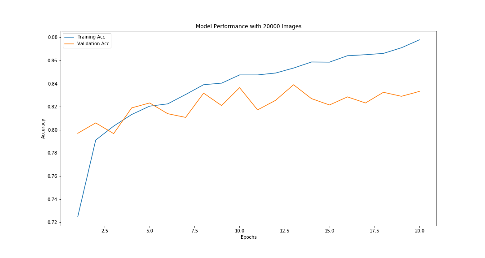

# Image Classification for Galaxy Morphologies

---

This project involoved the development of a custom convolutional neural network in order to classify different galaxy morphologies.

## Data Set:
---

Data used in this project is publically available on kaggle at:

https://www.kaggle.com/c/galaxy-zoo-the-galaxy-challenge/overview

The data set contained images as well as normalized survey responses for the Galaxy Zoo Survey:

Images in the data set were all 412x412 RGB images:

Survey Responses were given in csv format:

## Prerequisites

This repo is executed solely in python and requires the following imports to run:

## Project Summary:

As the number of images being taken to survey surrounding galaxies increases the need for classifying particular galaxies increases as well. Currently many galaxies are classified by crowd sourcing volunteers and having them identify certain shapes and morphologies by hand. Though this approach has worked in the past it becomes less feasible as the number of images moves into the millions and millions. This project looks at solving this problem through the use of Convolutional Neural Networks in order classify these images in a way that is more scalable to massive data sets.

## The Model:

The architecture used ended up being based on the architecture of AlexNet, one of the first CNNs to demonstrate their usefulness for image classification tasks. The final architecture and parameters are shown below.

The model utilizes sub sampling on the first three convolutional layers in order to make training feasible on a conventional laptop.

## Results:

The model was trained on a 4 core macbook pro for 2 hours and was able to identify whether a particular galaxy was smooth, contained features, or was a star/artifact with an accuracy of ~84%. 

## Authors
- Liam Wood Roberts
